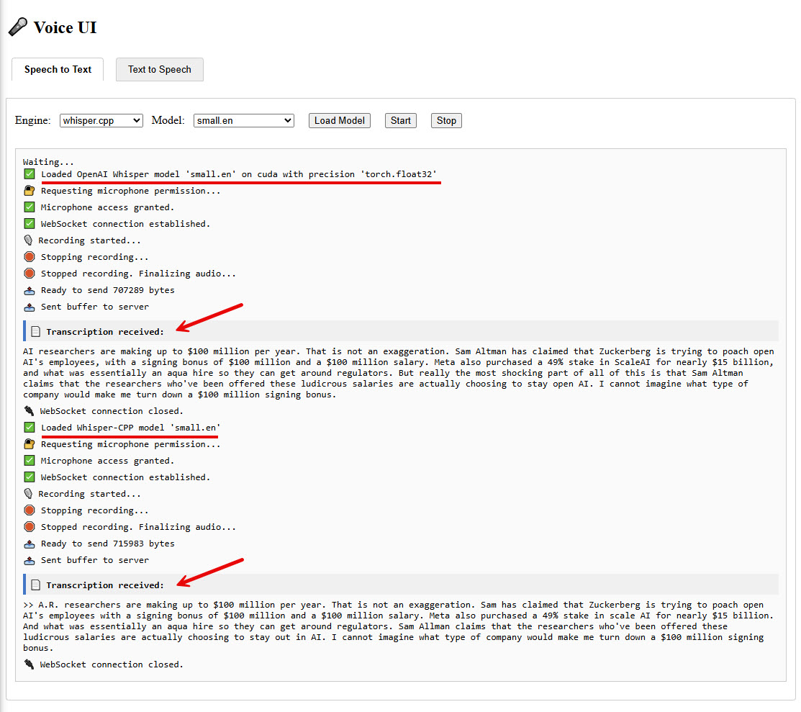

# Speak-IO

Speak-IO is a modular, containerized system for bi-directional speech processing. It offers both speech-to-text (STT) and text-to-speech (TTS) capabilities through a unified, offline-first architecture. The system is divided into multiple Docker containers, each encapsulating a specific responsibility to ensure scalability, maintainability, and ease of deployment.

Note that Speak-IO does not provide or train any speech models. Instead, it offers a microservice-based architecture that integrates and orchestrates existing open-source STT and TTS engines. Speak-IO handles model selection, loading, and inference - allowing you to experiment with and compare different models through a consistent and extensible API and user interface.

## System Architecture

The core components of Speak-IO include:

- **speech_to_text** container handles real-time or file-based transcription of spoken audio into text using a variety of STT engines such as `OpenAI Whisper`, `Whister.cpp`, `Faster-Whisper`, and `Vosk`. This component provides a WebSocket-based and HTTP interface for streaming and batch transcription.

- **text_to_speech** container synthesizes natural-sounding audio from input text using pluggable TTS engines such as `Coqui`, `Piper`, `Bark`, and `Chatterbox`. It supports model loading, multi-language synthesis, and wav output suitable for immediate playback.

- **voice_ui** container provides a lightweight web interface that allows users to interact with both the STT and TTS services. It features two main tabs - one for transcribing speech into text via microphone input, and another for synthesizing text into voice using configurable models and sample phrases in various languages.

- **hotword** container enables passive voice activation using offline wake word detection. This component continuously listens for predefined trigger phrases and activates downstream actions when a match is detected. An ideal hotword engine runs efficiently for extended periods with minimal CPU usage, supports low-latency detection, operates offline, and maintains high accuracy across varying accents and background noise conditions.

Each service is isolated but interoperable via REST APIs and WebSocket endpoints, making Speak-IO extensible and well-suited for both local experimentation and production use.

For further details, refer to the following documentations:

- [Speech to Text](speech_to_text/README.md)
- [Text to Speech](text_to_speech/README.md)
- [Hotword Detection](hotword/README.md)

## Getting Started

To run Speak-IO locally, ensure you have Docker and Docker Compose installed. The project is containerized and managed via Docker Compose, allowing you to spin up all services with minimal setup.

From the project root directory, build all Speak-IO containers using the following command:

    docker compose build

Once the build completes, launch all containers in the background:

    docker compose up -d

Wait for the containers to fully initialize. You can check the status using:

    docker compose ps
    docker logs <container/name>

These URLs provide access to speech-to-text:

- Swagger API docs: http://localhost:5000/api/docs
- API Base URL: http://localhost:5000/api/stt/

These URLs provide access to text-to-speech:

- Swagger API docs: http://localhost:5500/api/docs
- API Base URL: http://localhost:5500/api/tts/

Once the containers are up and running, access the Voice UI at:

    http://localhost:5600

From the web interface, you can begin experimenting with speech-to-text and text-to-speech features.

## Voice UI

Voice UI is the web interface for the Speak-IO project, designed to provide an intuitive and interactive way for users to access and test its speech capabilities. The interface is divided into two primary tabs: one for Speech-to-Text and another for Text-to-Speech.

### Speech-to-Text Tab

In the Speech-to-Text tab, users can select a supported engine and model combination. Once selected, clicking the "Load Model" button instructs the Speak-IO backend to download and prepare the specified model for transcription. Pressing "Start" requests microphone access from the browser and begins recording. While the recording is ongoing, the browser streams audio data to the backend in real time using a WebSocket connection. When the user clicks "Stop", the frontend sends a signal to the backend indicating that audio capture has ended and transcription should begin. The backend processes the streamed audio and returns the resulting text, which is then displayed in the web interface.

To demonstrate its effectiveness, we include a sample use case in which the following TikTok video was played through a microphone and transcribed by Speak-IO using two different engines. This showcases the system’s flexibility and accuracy in real-world scenarios.

[sample.mp4](https://github.com/user-attachments/assets/9ee05d9f-1035-47a4-83b7-c85eb8ba5b80)

Here is the sample transcribed output:

### Text-to-Speech (TTS) Tab

In the Text-to-Speech tab, users can explore and evaluate a variety of voice synthesis models supported by different engines. The interface allows users to first select a TTS engine, and then choose relevant parameters such as language, voice, and model quality - depending on the capabilities and structure of the selected engine.

Once the desired configuration is selected, clicking "Load Model" instructs the Speak-IO backend to download and initialize the model for use. Users may then enter any custom text they wish to synthesize or choose from a set of predefined sample paragraphs available in multiple popular languages, designed to highlight the clarity, tone, and pronunciation capabilities of each model.

When the "Speak" button is pressed, the typed or selected text is sent to the backend. The backend processes the text using the loaded model, synthesizes it into audio in WAV format, and streams it back to the web interface. The resulting audio is played in the browser, allowing users to hear the synthesized speech and compare the output across different models and languages.

