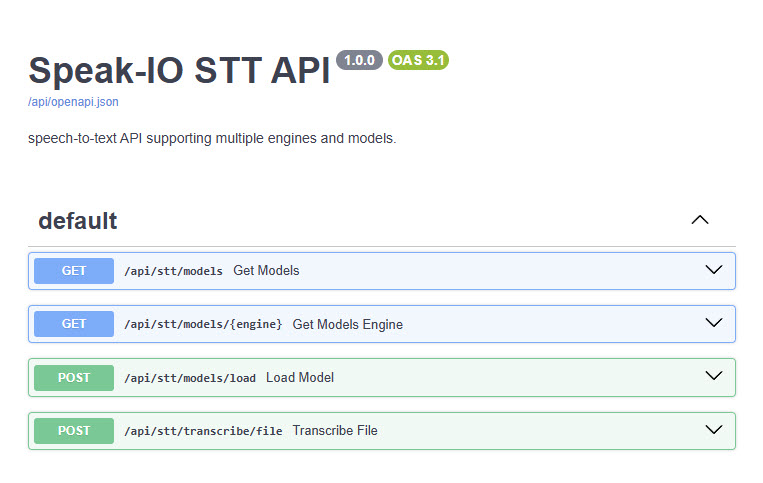

# Speech-to-Text (STT)

Speech-to-text (STT) is a technology that converts spoken language into written text. It's widely used in virtual assistants, transcription services, accessibility tools, voice-controlled systems, and more. By translating human speech into text, STT bridges the gap between audio communication and digital text-based systems. There are many cloud-based services that offer high-quality STT solutions (like Google Speech, Amazon Transcribe, or Microsoft Azure Speech). However, these often require an Internet connection, raise concerns about data privacy, and may not be suitable for real-time or offline scenarios.

## STT Models

The following offline speech-to-text models are supported by Speak-IO.

| Feature              | Vosk                             | OpenAI Whisper       | faster-whisper         | whisper.cpp             |
|----------------------|----------------------------------|----------------------|------------------------|-------------------------|
| CPU Support          | Optimized                        | Yes (slow)           | Yes (moderate)         | Optimized               |
| GPU Acceleration     | No                               | Yes (CUDA)           | Yes (CUDA)             | Yes (CUDA/Metal/OpenCL) |
| Torch Dependency     | No                               | Yes                  | No                     | No                      |
| Accuracy             | Moderate                         | High                 | High                   | High                    |
| Model Sizes          | Small to Medium                  | Tiny to Large        | CTranslate2 converted  | GGML quantized models   |
| Resource Usage       | Very Low                         | High                 | Low                    | Moderate                |
| Streaming Support    | Yes                              | No                   | No                     | Partial                 |
| Live Mic Input       | Native support                   | With integration     | With wrapper           | With wrapper            |
| Ideal Use Cases      | Real-time STT, hotword detection | Accurate batch STT   | Fast GPU-based STT     | Embedded/offline STT    |

### Vosk

[Vosk](https://github.com/alphacep/vosk-api) is a lightweight, offline-capable speech recognition toolkit built on top of Kaldi. It performs well on CPUs, including low-power devices like Raspberry Pi or Android phones. Vosk supports streaming recognition, enabling continuous, low-latency transcription without the need to process entire audio files in batches. However, its accuracy generally trails behind large transformer-based models like Whisper.

**Strengths:**

- Lightweight and fast on low-power CPUs
- Runs on Android, Raspberry Pi, and other embedded systems
- Supports over 20 languages
- Native support for streaming, speaker identification, and hotword detection

**Limitations:**

- CPU-only; no GPU acceleration
- Lower transcription accuracy than transformer-based models
- Limited support for multilingual mixed-language input

**Best Use Cases:**

- Hotword-activated voice interfaces
- Real-time STT on embedded or mobile platforms
- Offline voice assistants and IoT applications

### OpenAI Whisper (local)

[Whisper](https://github.com/openai/whisper) is an open-source automatic speech recognition (ASR) model developed by OpenAI. Trained on 680,000 hours of multilingual and multitask supervised data, it supports language identification, transcription, and speech translation. It runs entirely offline and does not require any cloud or internet connection. Whisper provides multiple model sizes (tiny → large) to trade off between performance and accuracy. All models are multilingual unless the name ends with `.en`, which limits them to English but offers enhanced accuracy for that language.

**Strengths:**

- High transcription accuracy across many languages
- Supports speech translation and language ID
- Large variety of model sizes
- Fully offline and open-source

**Limitations:**

- High memory and compute requirements for large models
- Inference is slow on CPU-only systems
- No native support for real-time streaming or hotword detection

**Best Use Cases:**

- Accurate transcription of recordings
- Multilingual batch audio processing
- Local STT with high quality requirements

### faster-whisper

[faster-whisper](https://github.com/SYSTRAN/faster-whisper) is an optimized implementation of Whisper that uses the CTranslate2 inference engine. It supports both GPU (CUDA) and CPU backends and offers faster inference with lower memory usage compared to the original PyTorch version. It provides the same transcription accuracy as Whisper and is ideal for production environments requiring low-latency or high-throughput processing. Open WebUI supports faster-whisper internally for speech-to-text.

**Strengths:**

- Fast inference using CTranslate2 (GPU and CPU)
- Same model accuracy as original Whisper
- Lower memory usage and faster startup
- Optimized for near real-time transcription using short buffered audio segments (pseudo-streaming)

**Limitations:**

- Requires additional setup (CTranslate2)
- No support for training; inference only
- No native streaming or hotword support

**Best Use Cases:**

- Production pipelines requiring fast, accurate transcription
- High-throughput batch processing
- Near real-time transcription with GPU acceleration

### whisper.cpp

[whisper.cpp](https://github.com/ggml-org/whisper.cpp), developed by Georgi Gerganov (creator of `llama.cpp`), is a C/C++ port of OpenAI's Whisper optimized for CPU execution. It eliminates dependencies like Python, PyTorch, or TensorFlow and is designed for minimal resource usage. It supports various GPU backends, including CUDA, Metal (Apple), and OpenCL, but also performs well on modern CPUs with quantized models. Additionally, whisper.cpp can be compiled to `WebAssembly`, enabling speech-to-text transcription directly in the browser or other web-based environments.

**Strengths:**

- Written in C++, no Python or PyTorch required
- Supports CPU and optional GPU acceleration
- Small binary footprint and easy integration
- Suitable for cross-platform and embedded use

**Limitations:**

- Slower on large audio files without GPU
- May lag behind the latest Whisper features
- No built-in training or fine-tuning support

**Best Use Cases:**

- Edge devices (e.g., Raspberry Pi, ARM boards)
- Offline STT in CLI tools or native apps
- Lightweight containers without Python runtime

## Real-time Speach-to-Text

Real-time speech-to-text is the process of continuously converting spoken audio into written text as the speech is happening. Unlike traditional transcription, which processes entire recordings after they are finished, real-time STT captures live audio (often from a microphone or streaming source) and transcribes it on the fly with minimal delay. This requires specialized techniques like streaming audio processing, voice activity detection (VAD), and incremental decoding to provide accurate and low-latency transcriptions. Real-time STT is essential for applications such as live captions, voice assistants, and real-time communication tools, where immediate feedback is important.

OpenAI Whisper and faster-whisper are suitable for batch processing of full recordings, and are not designed for real-time audio streaming. However, it is possible to simulate real-time transcription by capturing audio in short chunks (e.g., every 1–3 seconds) using tools like `pyaudio` or `sounddevice`, then periodically feeding those chunks into the model for transcription. This approach mimics live speech-to-text by buffering recent audio, transcribing it on a rolling basis, and displaying partial results continuously.

whisper.cpp, a C++ implementation of Whisper optimized for CPU usage, supports microphone streaming mode using [whisper-stream](https://github.com/ggml-org/whisper.cpp/tree/master/examples/stream) tool, allowing real-time transcription with minimal dependencies. However, it may experience lag or reduced performance on low-power or older CPUs due to the intensive nature of inference without GPU acceleration. The following invocation samples the audio every second and runs the transcription continously.

    whisper-stream -m ./models/ggml-small.en.bin -t 8 --step 1000 --length 5000

Vosk is particularly well-suited for real-time STT applications due to its efficient streaming architecture and low resource requirements. Unlike large transformer-based models, Vosk uses a lightweight Kaldi backend that enables continuous decoding of incoming audio streams with minimal latency. It supports real-time transcription from microphones or any live audio source by processing small chunks incrementally, without needing to wait for the full audio input.

## Audio Input Methods

STT supports multiple audio ingestion methods, allowing it to integrate with various frontends and use cases.

**Pre-recorded Audio Files**

Upload an audio file from disk or web interface and send them to the backend for transcription. The following are among the most widely used audio formats in speech-to-text applications, each with specific trade-offs:

- `WAV` is a raw, uncompressed format that preserves the full fidelity of speech signals, making it the preferred choice for accurate transcription and model training where clarity and detail are critical.

- `MP3`, being a lossy and compressed format, significantly reduces file size but may introduce compression artifacts that can degrade transcription accuracy - though it remains popular for user-contributed audio and casual testing due to its broad compatibility.

- `FLAC` (Free Lossless Audio Codec) offers a middle ground, compressing audio without loss of quality. It is well-suited for storing speech data efficiently when maintaining audio integrity is important but space savings are also desired.

**Audio Streaming via WebSocket**

Users can record live speech, and audio is streamed in real-time to the backend over WebSockets for transcription. This audio stream can originate either from the browser (using the MediaRecorder API or Web Audio API) or from a local application that captures microphone input.

Browsers using the MediaRecorder API typically encode audio in `WebM` containers using codecs like Opus by default, due to their efficiency and wide browser support. Thus, audio data streamed over WebSockets from the browser is saved in WebM format. Most STT engines do not natively support WebM or Opus-encoded audio, and using them directly may result in decoding errors. Before passing the audio to the STT engine, we convert the WebM file to a WAV format using `ffmpeg` utility.

## REST Endpoints

Here are endpoints exposed by speech-to-text service:

| Method | Endpoint                        | Description                                                            |
|--------|---------------------------------|------------------------------------------------------------------------|
| GET    | `/api/stt/models`               | Returns a list of all available STT engines and their models           |
| GET    | `/api/stt/models/{engine}`      | Returns the available models for a specific STT engine                 |
| POST   | `/api/stt/models/load`          | Loads and prepares the specified STT model on the backend              |
| POST   | `/api/stt/transcribe/file`      | Uploads an audio file and transcribes it using the selected model      |
| WS     | `/api/stt/transcribe/stream`    | WebSocket endpoint for real-time audio streaming and transcription     |

Here is the Swagger documentation. Note that `/api/stt/transcribe/stream` is a WebSocket route and does not appear in Swagger which is expected.

To demonstrate how Speak-IO performs speech-to-text, let’s walk through a simple example. Before transcription can begin, you should load the desired speech-to-text model. This example uses `openai_whisper` with the `small.en` model:

    curl -X POST "http://localhost:5000/api/stt/models/load?engine=openai_whisper&model_name=small.en"

Once the model is loaded, you can submit an audio file for transcription. The following example sends a `.wav` file to the STT API and receives the transcribed text in response:

    curl -X POST "http://localhost:5000/api/stt/transcribe/file?engine=openai_whisper&model_name=small.en" -F "file=@/home/maniam/whisper.cpp/samples/jfk.wav"
