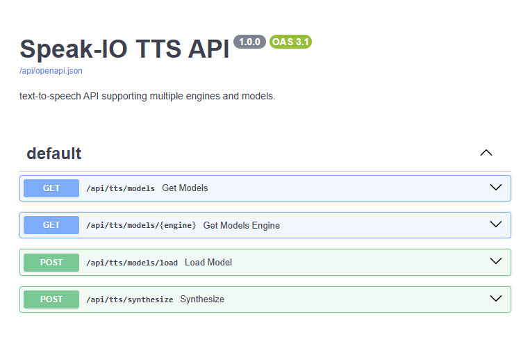

# Text-to-Speech (TTS)

Text-to-speech (TTS) is a technology that converts written text into audible speech. It's used in a wide range of applications including virtual assistants, navigation systems, accessibility tools for the visually impaired, voice-enabled interfaces, and automated announcements. TTS systems help bridge the gap between digital information and auditory communication, making technology more accessible and interactive. While cloud-based TTS services from providers like Amazon Polly, Google Cloud Text-to-Speech, and Microsoft Azure offer advanced neural voices, they require a persistent Internet connection and raise privacy concerns when transmitting user data. Offline, locally hosted TTS engines offer an alternative, ensuring faster response times, full data control, and seamless integration into private or embedded environments.

## TSS Models

The Speak-IO project supports multiple Text-to-Speech engines, each designed with unique strengths and trade-offs to serve a variety of speech synthesis needs. The supported engines offer users the flexibility to choose between high-fidelity human-like synthesis, lightweight deployment, and expressive generative audio. By supporting these engines, Speak-IO empowers users to select the right tool based on deployment constraints, quality needs, and use-case complexity.

**Coqui TTS**

[Coqui TTS](https://github.com/coqui-ai/TTS) is a powerful open-source engine that supports advanced models like XTTS v2, offering high-quality, multilingual, and multi-speaker synthesis. It enables fine-grained control over speaker embeddings, supports voice cloning, and runs fully offline, making it ideal for privacy-conscious and highly customizable deployments. However, its biggest drawback is resource consumption and latency. Coqui models often require a GPU to perform efficiently and can be slow on CPU. Additionally, setting up certain models may involve handling large files and dependencies, which can increase operational complexity.

**Piper**

[Piper](https://github.com/rhasspy/piper) is designed for efficiency and simplicity. It’s optimized to run on low-power devices like the Raspberry Pi, making it a strong candidate for real-time applications, IoT devices, or embedded systems. Piper models load quickly, require minimal resources, and still deliver clear output. That said, its main limitation is naturalness. Piper voices, while intelligible and pleasant, often lack the nuance, emotional inflection, and prosody that more sophisticated models offer. It also doesn't support speaker cloning or expressive variations, which limits its applicability in lifelike narration or entertainment use cases.

**Suno Bark**

[Suno Bark](https://github.com/suno-ai/bark) is an advanced generative model inspired by large language models and trained end-to-end for audio synthesis. It is capable of producing deeply expressive and human-like speech, complete with natural pauses, tone variation, and even non-verbal expressions such as laughter or sighs. It’s particularly effective for storytelling, creative content, or demo-quality applications where realism is critical. Bark’s primary disadvantage lies in its high resource requirements and very slow inference speed. It demands a modern GPU and substantial VRAM to run effectively, making it less suitable for real-time applications or deployment on lightweight hardware.

Bark's synthesis process is built on a multi-stage model pipeline consisting of the `text`, `coarse`, `fine`, and `codec` models, each responsible for a distinct transformation of the input. The text model converts raw input text into semantic tokens that represent the intended meaning, tone, and structure of the speech. These tokens are then processed by the coarse model, which maps them into a low-resolution acoustic representation that captures rhythm, pitch, and basic vocal traits. The fine model takes this coarse representation and generates high-resolution audio tokens that contain more detailed acoustic features. Finally, the codec_model decodes these tokens into a continuous waveform using a neural audio codec, such as EnCodec.

    Text ──► [Text Model] ──► Semantic Tokens ──► [Coarse Model] ──► Coarse Audio Tokens ──► [Fine Model] ──► Audio Tokens ──► [Codec Model] ──► Audio Waveform (float32)

The output of the codec_model is a NumPy array of float32 values representing raw PCM waveform audio, typically ranging from -1.0 to 1.0. While this is a valid internal format, most standard `.wav` files use 16-bit signed integers (int16) for compatibility with audio players and editing tools. Therefore, before saving the output as a `.wav` file, it should be converted by scaling the float values to the int16 range ([-32768, 32767]). This ensures proper playback and adherence to standard audio formats.

**Chatterbox**

[Chatterbox](https://github.com/resemble-ai/chatterbox) TTS is an expressive neural TTS system that enables emotionally-rich, multi-speaker speech generation using a two-stage architecture: `T3` for token-level generation and `S3` for waveform decoding. It is particularly suited for scenarios requiring stylized, expressive voices, such as digital storytelling, character-based narration, and immersive voice interfaces.

Chatterbox operates by conditioning generation on audio prompts (short voice samples used to capture speaker characteristics and emotional tone). These prompts allow it to generalize across voices and styles with high flexibility. The system can be further controlled using parameters like `exaggeration`, `temperature`, and `cfg_weight` to tune the expressiveness and diversity of the generated audio.

A key feature of Chatterbox is the explicit separation of conditioning and synthesis: users can load an audio prompt once and then generate multiple speech outputs with consistent voice and style. This makes it efficient for batch generation and controlled voice personas. Chatterbox relies heavily on GPU acceleration for reasonable performance, making it less suited for edge deployment or lightweight environments.

## Text Preprocessing

Before textual input is passed to a text-to-speech model, it undergoes an important preprocessing stage to ensure accurate, natural, and robust speech synthesis. This step addresses common inconsistencies in user-provided text that can otherwise lead to mispronunciations, awkward pacing, or even synthesis errors.

- **Unicode Normalization**: Preprocessing typically includes Unicode normalization (such as NFKC), which restructures characters into a consistent form by decomposing combined glyphs and recomposing them into standardized units. This helps eliminate ambiguities, especially in languages or inputs that use diacritics, ligatures, or stylistic variants.

    | Input Text        | Normalized Output | Description                       |
    |-------------------|-------------------|-----------------------------------|
    | `financial`        | `financial`       | Ligature (`fi`)                    |
    | `élite`           | `élite`           | `e` + combining acute accent      |
    | `① Choice`        | `1 Choice`        | Unicode circled number            |
    | `ℌello 𝕎orld`    | `Hello World`    | Decorative Unicode characters     |

- **Special Punctuation**: Special typographic punctuation (such as curly quotes, em dashes, and ellipses) is often replaced with their ASCII equivalents to ensure compatibility across models. Since many TTS engines are trained on clean, plain-text corpora, unrecognized symbols or formatting may negatively affect pronunciation or prosody.

    | Input Text                    | Replaced Output              | Description                          |
    |-------------------------------|------------------------------|--------------------------------------|
    | `“Hello”—he said…`            | `"Hello"-he said...`         | Curly quotes, em dash, ellipsis      |
    | `‘It’s fine,’ she replied.`   | `'It's fine,' she replied.`  | Curly single quotes                  |
    | `• Step 1: Start`             | `* Step 1: Start`            | Bullet symbol                        |

- **Whitespace Normalization**: Whitespace normalization and trimming further help in creating a compact, predictable input string that is easier for the TTS model to process.

    | Input Text                    | Cleaned Output         | Description                                |
    |-------------------------------|------------------------|--------------------------------------------|
    | `   Welcome     back!   `     | `Welcome back!`        | Extra spaces and leading/trailing spaces   |
    | `Line one\n\nLine two`        | `Line one Line two`    | Extra newlines                             |
    | `Word1\t\tWord2`              | `Word1 Word2`          | Multiple tabs                              |

Together, these text preprocessing steps ensure that the engine receives well-structured input, which in turn enhances the clarity, fluency, and expressiveness of the synthesized speech. This preprocessing is especially important in multilingual contexts, where character encoding and formatting inconsistencies are more likely to arise.

## REST Endpoints

Here are endpoints exposed by text-to-speech service:

| Method | Endpoint                        | Description                                                             |
|--------|---------------------------------|-------------------------------------------------------------------------|
| GET    | `/api/tts/models`               | Returns available TTS engines and their hierarchical model structures   |
| GET    | `/api/tts/models/{engine}`      | Returns the available models for a specific TTS engine                  |
| POST   | `/api/tts/models/load`          | Loads and prepares the selected TTS model on the backend                |
| POST   | `/api/tts/synthesize`           | Synthesizes speech from raw body                                        |

Here is the Swagger documentation:

To demonstrate how Speak-IO performs text-to-speech, let’s walk through a simple example. Before synthesizing speech, load the desired TTS model. The example below uses the `piper` engine with a specific model name:

    curl -X POST "http://localhost:5500/api/tts/models/load?engine=piper&model_name=en_US-lessac-medium"

Once the model is loaded, you can send any input text and receive a synthesized `.wav` audio response. Here's how to send a sentence using the POST method:

    curl -X POST "http://localhost:5500/api/tts/synthesize?engine=piper&model_name=en_US-lessac-medium" \
    -H "Content-Type: text/plain" \
    --data "Hello! This is a test of the Piper speech synthesis engine." \
    --output output.wav
